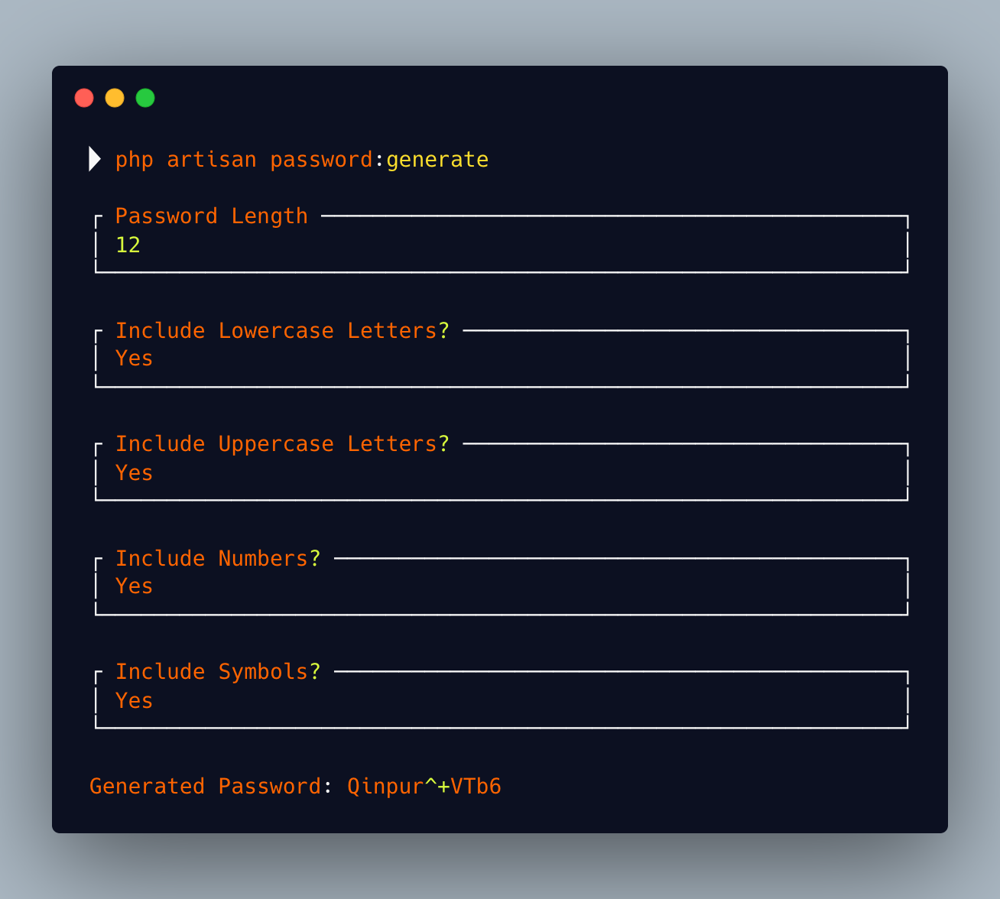
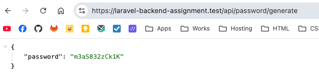
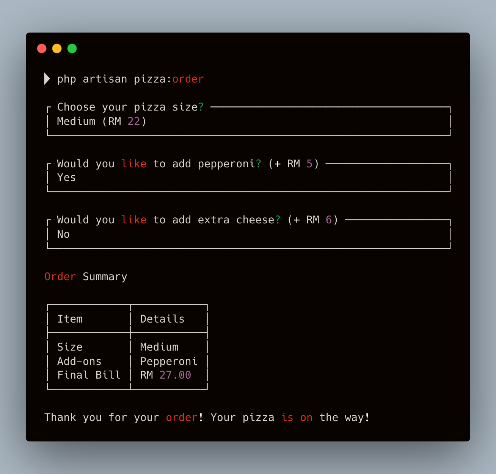
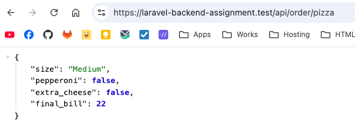

## 🖥 Requirements

The following tools are required in order to start the installation.

* PHP 8.3 or higher
* Database (eg: MySQL, MariaDB)
* Web Server (eg: Nginx, Apache)
* Local Development (Valet/Herd for Mac or Laragon for Windows)

## 🚀 Installation

To install the application, follow these steps:

**Option 1: Using script (recommended)**

Run this command in your terminal:

```shell
./scripts/install.sh
```

To update the project:

```shell
./scripts/update.sh
```

**Option 2: Manual installation**

1. Clone the repository with `git clone`
2. Copy __.env.example__ file to __.env__ and edit database credentials there

    ```shell
    cp .env.example .env
    ```

3. Install composer packages

    ```shell
    composer install
    ```

4. Install npm packages and compile files

    ```shell
    npm install
    ```

   For **Development**:
    ```shell
    npm run dev
    ```

   For **Production**:
    ```shell
    npm run build
    ```

5. Generate `APP_KEY` in **.env**

    ```shell
    php artisan key:generate
    ```

6. Running migrations and all database seeds

    ```shell
    php artisan migrate --seed
    ```

You can now visit the app in your browser by
visiting [https://laravel-backend-assignment.test](https://laravel-backend-assignment.test).

## Assignment Questions

1. Write a password generator which is able to have small, capital letters, numbers, symbols and minimum length. The
   generator can customize it such as small, capital letters, numbers and minimum length or all above. Symbols:
   `['!', '#', '$', '%', '&', '(', ')', '*', '+', '@', '^']`. **Print out the password.**


* [app/Services/PasswordGeneratorService.php](app/Services/PasswordGeneratorService.php)
* [app/Console/Commands/PasswordGenerator.php](app/Console/Commands/PasswordGenerator.php)

  **Results:**
  

* [app/Http/Controllers/PasswordGenerateController.php](app/Http/Controllers/PasswordGenerateController.php)
  `Add header: Accept: application/json`

  **Results:**

  

2. Build a simple automatic pizza ordering program.
    * Small pizza: RM15
    * Medium pizza: RM22
    * Large pizza: RM30
    * Pepperoni for small pizza: +RM3
    * Pepperoni for medium pizza: +RM5
    * Extra cheese for any size pizza: +RM6

   Based on an user’s order, work out their final bill.


* [app/Services/PizzaOrderService.php](app/Services/PizzaOrderService.php)
* [app/Console/Commands/PizzaOrder.php](app/Console/Commands/PizzaOrder.php)

  **Results:**
  

* [app/Http/Controllers/PizzaOrderController.php](app/Http/Controllers/PizzaOrderController.php)
  `Add header: Accept: application/json`

  **Results:**

  

3. Users have many credits, each credit has a balance column and created datetime (timezone UTC). Write an SQL statement
   to retrieve users’ last credit balance on 31st December 2022.

```sql
SELECT u.id AS user_id, c.balance, c.created_at
FROM users u
         LEFT JOIN credits c
                   ON c.user_id = u.id
                       AND c.created_at = (SELECT MAX(c2.created_at)
                                           FROM credits c2
                                           WHERE c2.user_id = u.id
                                             AND c2.created_at <= '2022-12-31 23:59:59');
```

4. What is the difference between after_save VS after_commit? (Rails) OR What is the difference between saved VS
   afterCommit? (Laravel)

| saved                                                                                                | afterCommit                                                                     |
|------------------------------------------------------------------------------------------------------|---------------------------------------------------------------------------------|
| Fires immediately after a model is saved (created or updated)                                        | Fires after the database transaction is committed                               |
| Fires within the database transaction if one is active                                               | Only executes if the transaction successfully completes                         |
| If the transaction is rolled back later, any side effects from saved listeners have already occurred | If the transaction rolls back, afterCommit listeners never fire                 |
| This is the default behavior for most model events                                                   | Safer for external side effects like sending emails, API calls, or queuing jobs |

5. Users’ have many comments and comments can be liked by other users. Write an SQL statement to count how many
   users liked that comment.

```sql
SELECT comments.id                  AS comment_id,
       comments.user_id             AS comment_owner_id,
       COUNT(comment_likes.user_id) AS total_likes
FROM comments
         LEFT JOIN comment_likes
                   ON comment_likes.comment_id = comments.id
GROUP BY comments.id, comments.user_id;
```

6. A snail can climb up 3 meters a day and it will drop 2 meters at night. The well is 11 meters deep. How many days
   will the snail need to come out from the well and the snail starts climbing in the morning?

---

Daily Progress Table

| Day | Position at Start | Climbs (+3m) | Position After Climb | Falls (-2m) | Position at End | Notes |
|-----|-------------------|--------------|----------------------|--------------|-----------------|--------|
| 1 | 0m | +3m | 3m | -2m | 1m | Net gain: 1m |
| 2 | 1m | +3m | 4m | -2m | 2m | Net gain: 1m |
| 3 | 2m | +3m | 5m | -2m | 3m | Net gain: 1m |
| 4 | 3m | +3m | 6m | -2m | 4m | Net gain: 1m |
| 5 | 4m | +3m | 7m | -2m | 5m | Net gain: 1m |
| 6 | 5m | +3m | 8m | -2m | 6m | Net gain: 1m |
| 7 | 6m | +3m | 9m | -2m | 7m | Net gain: 1m |
| 8 | 7m | +3m | 10m | -2m | 8m | Net gain: 1m |
| 9 | 8m | +3m | 11m | — | **OUT!** | No fall |

---

Formula


$$
\text{Days} = \frac{(\text{Well Depth} - \text{Climb per Day})}{\text{Net Progress per Day}} + 1
$$

Example:

$$
\text{Days} = \frac{(11 - 3)}{1} + 1 = 9
$$

**Answer: 9 days**

---
**Final Answer:**  
The snail will take **9 days** to climb out of the 11-meter well.